# Intactness and Cumulative Disturbance Datasets Used in Analysis

Revised: 2020-06-25

## Introduction

Intactness and disturbance datasets are increasingly used by conservation planners to design and evaluate protected areas. This page describes several freely available global and regional datasets that measure intactness (e.g., intact forest landscapes) or cumulative disturbances (e.g., human footprint maps) and which covers most or all of the the boreal region of North America.

## Intactness datasets

### Global Intact Forest Landscapes (2000, 2013, 2016)

The global Intact Forest Landscapes maps describe large unbroken expanses of natural ecosystems for the years 2000, 2013 and 2016 within areas of current forest extent, without signs of significant human activity, and having an area of at least 500 km2. The forest zone boundary was defined using a global tree canopy cover dataset (MODIS 500m) and included all areas with a tree canopy cover &gt; 20% in the year 2000. The global IFL maps were created using maps of human settlements and transportation networks and a global coverage of high spatial resolution satellite imagery (Landsat 5 & 7, 30m).

  - Data years: 2000, 2013, 2016
  - References: Potapov et al. 2008, 2017
  - Website: http://www.intactforests.org/

 <a href="maps/ak_gifl2016.png">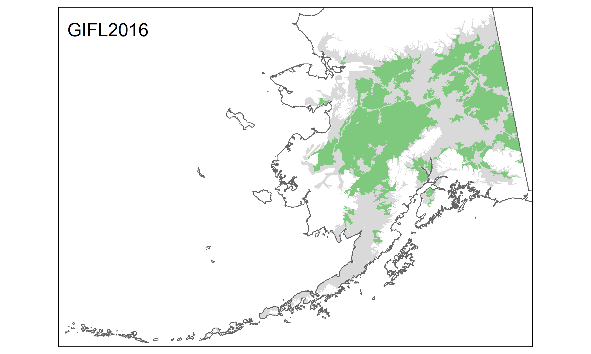</a><a href="maps/ca_gifl2016.png">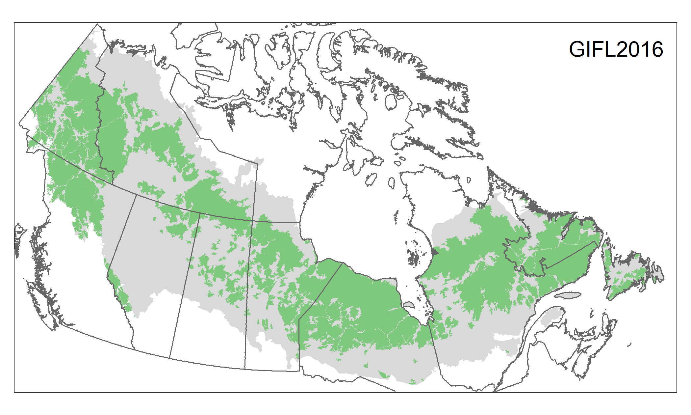</a> 

### Frontier Forests (1996)

The Forest Frontiers map was the first attempt to create a global map of the remaining large, ecologically intact, and relatively undisturbed natural forest landscapes. The map shows where the last remaining large areas of forest remains and provides an assessment of the degree of threat (low or no threat, medium or high threat, unassessed for threat). The maps were created from readily-accessible, but variable, ancillary information such as roads, and numerous experts provided advice and reviews. Unlike the other more recent approaches, Frontier Forests did not use consistent and more recent data sources such as satellite imagery. The Forest Frontiers map was published in 1997 by World Resources Institute.

  - Data years: 1996
  - References: Bryant et al. 1997
  - Website: http://www.wri.org/publication/last-frontier-forests

 <a href="maps/ak_ff1996.png">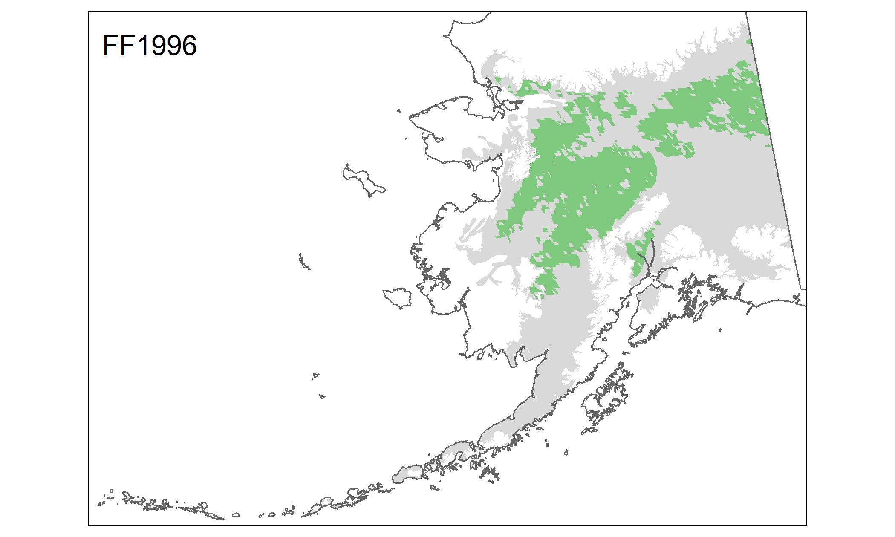</a><a href="maps/ca_ff1996.png">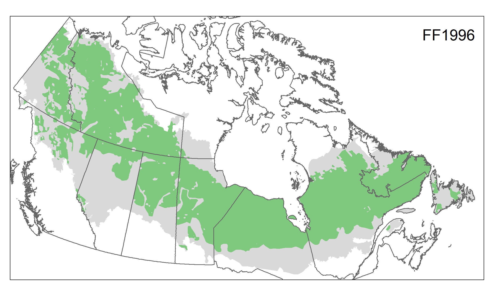</a> 

### Canada Intact Forest Landscapes (2000, 2013)

The Intact Forest Landscapes maps (CIFL 2000 and CIFL 2013; ) depict Canada's remaining forest landscape fragments for the years 2000 and 2013. The datasets use specified size thresholds of 5,000 hectares for boreal regions and 1,000 hectares for temperate forest regions. The map was produced using (i) existing datasets describing major anthropogenic changes/disturbances (e.g., roads, other linear features, reservoirs) to exclude large areas influenced by human activities and (ii) satellite imagery (Landsat 5 and 7, 30m) to identify finer scale anthropogenic disturbances (e.g., cutblocks, cutlines) within candidate intact forest landscapes.

  - Data years: 2000, 2013
  - References: Lee 2006, Smith and Cheng 2016
  - Website: https://databasin.org/datasets/a1d3559466574164a4f99be6a2445cea

 <a href="maps/ca_cifl2013.png">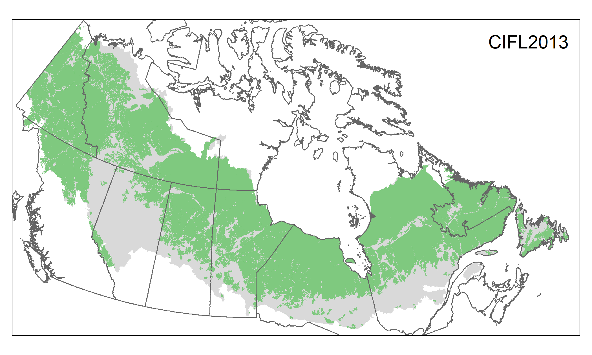</a> 

## Cumulative disturbance datasets

### Human Footprint

Human Footprint data are a standardized measure of cumulative human pressures on the environment that take into account the extent of built environments, crop land, pasture land, human population density, night-time lights, railways, roads and navigable waterways. The Human Footprint ranges between values of 0 and 50, calculated at a 1 km2 resolution across the Earth’s terrestrial surface. A value of 0 is equivalent to no detectable human pressures of the type incorporated in the index. Human Footprint maps were originally available for 1993 and 2009 but were recently revised for the year 2000, 2005, 2010, and 2013.

  - Data years: 1993, 2009; 2000, 2005, 2010, 2013
  - References: Sanderson et al. 2002, Venter et al. 2016a, 2016b, Williams et al. 2020
  - Website (1993, 2009): http://datadryad.org/resource/doi:10.5061/dryad.052q5
  - Website (2000, 2005, 2010, 2013): https://github.com/scabecks/humanfootprint_2000-2013

 <a href="maps/ak_hfp2013.png">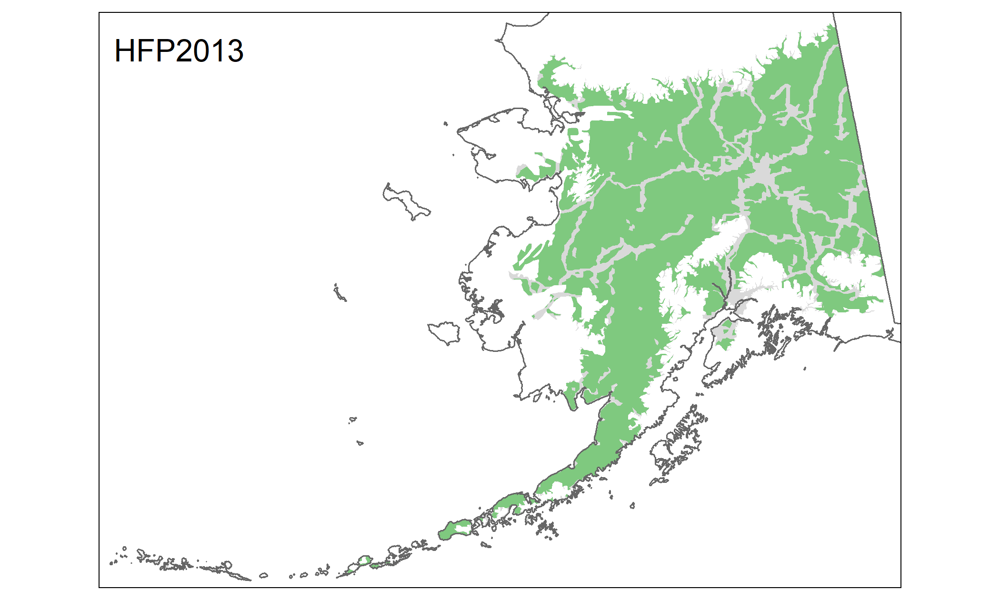</a><a href="maps/ca_hfp2013.png">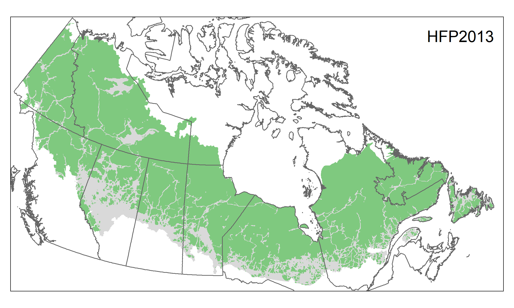</a> 

### Global Human Modification (2015)

The global Human Modification map provides a cumulative measure of human modification of terrestrial lands across the globe at a 1-km2 resolution. It is a continuous 0-1 metric that reflects the proportion of a landscape modified based on modeling the physical extents of 13 anthropogenic stressors and their estimated impacts using spatially-explicit global datasets with a median year of 2016.

  - Data years: 2016
  - References: Kennedy et al. 2019
  - Website: https://figshare.com/articles/Global_Human_Modification/7283087

 <a href="maps/ca_ghm2016.png">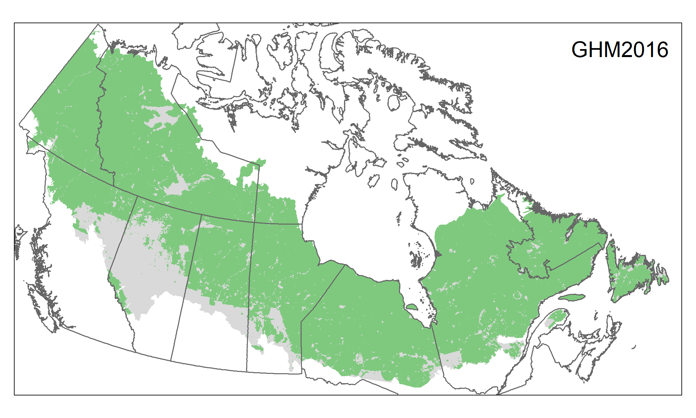</a> 

### Low Impact Areas (2015)

The Low Impact Areas dataset uses open-access, frequently updated data sets on terrestrial human impacts (human population density, built-up area, cropland, livestock, forest cover change, roads, night-time lights) to create a new categorical map of global human influence ("Low Impact Areas" and "Very Low Impact Areas") at a 1-km2 resolution.

  - Data years: 2015
  - References: Jacobson et al. 2019
  - Website: https://datadryad.org/stash/dataset/doi:10.5061/dryad.z612jm67g

 <a href="maps/ak_vlia2015.png">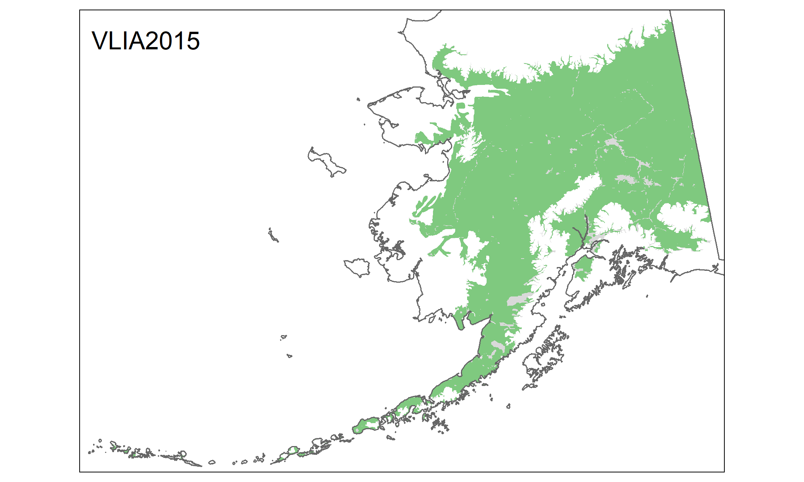</a> 

### Canada Human Access (2010)

Global Forest Watch Canada's Human Access dataset is current to circa 2010. Human access is the combined land surface anthropogenic disturbances caused mainly by industrial activities, which include, but are not limited to, roads, mines, clearcuts, wellsites, pipelines, transmission lines, and agricultural clearings. All disturbances (i.e., access) were buffered by 500 metres. The Canada Access 2010 dataset was created as the initial step in creating the Canada IFL maps.

  - Data years: 2010
  - References: Lee and Cheng 2014
  - Website: https://globalforestwatch.ca/sites/gfwc/files/data/20140109B_Canada_Access_2010_metadata.html

 <a href="maps/ca_ha2010.png">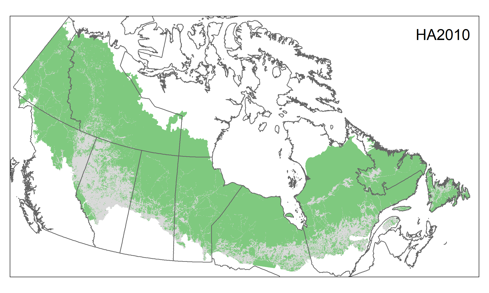</a> 

### Boreal Ecosystem Anthropogenic Disturbance (2010, 2015)

Boreal ecosystem anthropogenic disturbance (BEAD) layers for Canada. A vector disturbance dataset of unbuffered individual linear and polygonal disturbance types covering 51 caribou ranges in Canada. The dataset is based on 2008-2010 Landsat 5 imagery and each disturbance type was also gridded to a 1 km2 resolution and represent total km2/km2 for polygonal disturbances and km/km2 for linear disturbances. In total, nineteen individual raster layers were produced including layers representing total polygonal and linear disturbances. The dataset was updated for some ranges in 2012 and 500m buffers were applied. More recently, the dataset was updated for all ranges in 2015 using 30-m and 15-m Landsat 8 imagery from 2015-2017.

  - Data years: 2010, 2015
  - References: Pasher et al. 2013
  - Website: http://open.canada.ca/data/en/dataset?q=Boreal+ecosystem+anthropogenic+disturbance

 <a href="maps/ca_bead2010.png">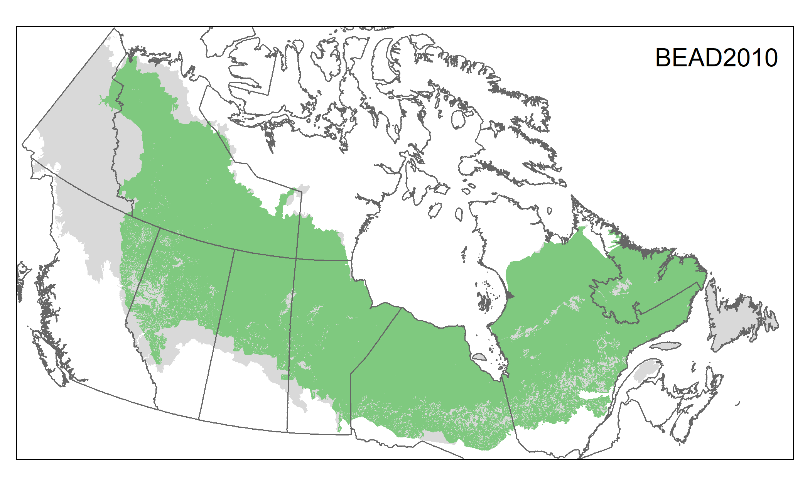</a> 

### Anthropogenic Biomes

Note: Description needs to be updated to reflect latest datasets.

Anthropogenic biomes (anthromes) characterize the human-altered form and dynamics of terrestrial ecosystems. They denote long-term patterns in human populations and their land use, taking into account population density, agricultural village development, percentage cover by crops, pasture and rice, irrigated land area and areas potentially covered by trees. Anthromes version 2 data were calculated using a 100 km2 equal area hexagonal discrete global grid format. The three wildland categories (wild forest, sparse trees, and barren) are of primary interest for identifying intact areas.

  - Data years: 2000, 2005, 2010, 2015
  - References: Ellis et al. 2020
  - Website: https://dataverse.harvard.edu/dataset.xhtml?persistentId=doi:10.7910/DVN/G0QDNQ

 <a href="maps/ak_ab2015.png">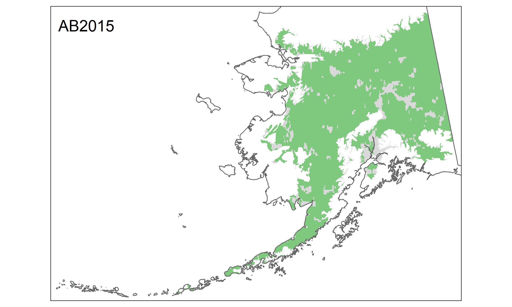</a><a href="maps/ca_ab2015.png">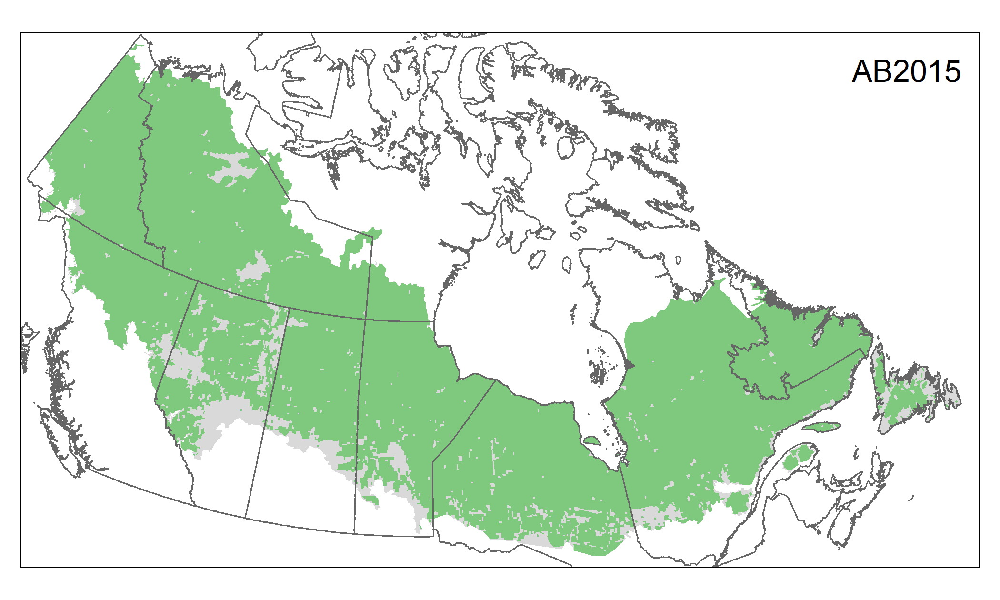</a> 

## References

Bryant, D., Nielsen, D., Tangley, L. 1997. The last frontier forests: Ecosystems and economies on the edge. World Resources Institute, Washington, D.C.

Ellis, E.C., and Ramankutty, N., 2008. Putting people in the map: anthropogenic biomes of the world. Frontiers in Ecology and the Environment 6, <doi:10.1890/070062>. URL: <http://www.esajournals.org/doi/abs/10.1890/070062>

Ellis, E.C., K. Klein Goldewijk, S. Siebert, D. Lightman, and N. Ramankutty. 2010. Anthropogenic transformation of the biomes, 1700 to 2000. Global Ecology and Biogeography 19(5):589-606

Ellis, E.C., Beusen, A.H., Goldewijk, K.K. 2020. Anthropogenic Biomes: 10,000 BCE to 2015 CE. Land 9(5), 129. https://doi.org/10.3390/land9050129

Jacobson, A.P., Riggio, J., Tait, A.M. and Baillie, J.E. 2019. Global areas of low human impact (Low Impact Areas) and fragmentation of the natural world. Scientific reports 9(1):1-13. http://dx.doi.org/10.1038/s41598-019-50558-6

Kennedy C.M., Oakleaf J.R., Theobald D.M., Baruch-Mordo S., Kiesecker J. 2019. Managing the middle: A shift in conservation priorities based on the global human modification gradient. Global Change Biology 25:811-826. https://doi.org/10.1111/gcb.14549

Lee, P., Gysbers, J.D., Stonojevic, Z. 2006. Canada's forest landscape fragments: A first approximation (A Global Forest Watch Canada Report). Edmonton, Alberta: Global Forest Watch Canada. 97pp.

Lee, P. G. 2009. Caution against using intact forest-landscapes data at regional scales. Ecology and Society 14(1): r1. URL: <http://www.ecologyandsociety.org/vol14/iss1/resp1/>

Lee, P.G. and Cheng, R. 2014. Human Access in Canada's Landscape. Global Forest Watch Canada.

Pasher, J, Seed, E, Duffe, J. 2013. Development of boreal ecosystem anthropogenic disturbance layers for Canada based on 2008 to 2010 Landsat imagery. Can. J. Remote Sensing 39(1): 42-58.

Potapov, P., Yaroshenko, A., Turubanova, S., Dubinin, M., Laestadius, L., Thies, C., Aksenov, D., Egorov, E., Yesipova, Y., Glushkov, I., Karpachevskiy, M., Kostikova, A., Manisha, A., Tsybikova, E., Zhuravleva, I.. 2008. Mapping the world's intact forest landscapes by remote sensing. Ecology and Society 13(2): 51. URL: <http://www.ecologyandsociety.org/vol13/iss2/art51/>

Potapov, P., Hansen, M.C., Laestadius, L., Turubanova, S., Yaroshenko, A., Thies, C., Smith, W., Zhuravleva, I., Komarova, A., Minnemeyer, S., Esipova, E. 2017 The last frontiers of wilderness: Tracking loss of intact forest landscapes from 2000 to 2013. Science Advances 3: 1-13.

Sanderson, E.W., Jaiteh, M., Levy, M.A., Redford, K.H., Wannebo, A.V., Woolmer, G. 2002. The human footprint and the last of the wild. BioScience 52:891-904.

Smith, W. and Cheng, R. 2016. Canada's Intact Forest Landscapes Updated to 2013. Ottawa: Global Forest Watch Canada. 26 pp.

Venter, O. et al. 2016a Global terrestrial Human Footprint maps for 1993 and 2009. Sci. Data 3, 160067.

Venter, O. et al. 2016b. Sixteen years of change in the global terrestrial human footprint and implications for biodiversity conservation. Nat. Commun. 7, 12558

Williams, Brooke Anne and Venter, Oscar and Allan, James R. and Atkinson, Scott C. and Rehbein, Jose A. and Ward, Michelle S. and Di Marco, Moreno and Grantham, Hedley S. and Ervin, Jamison and Goetz, Scott and Hansen, Andrew J. and Jantz, Patrick and Pillay, Rajeev and Rodríguez-Buriticá, Susana and Supples, Christina and Virnig, Anne L. S. and Watson, James E.M., Change in Terrestrial Human Footprint Drives Continued Loss of Intact Ecosystems. ONE-EARTH-D-20-00100. Available at SSRN: https://ssrn.com/abstract=3600547 or http://dx.doi.org/10.2139/ssrn.3600547
